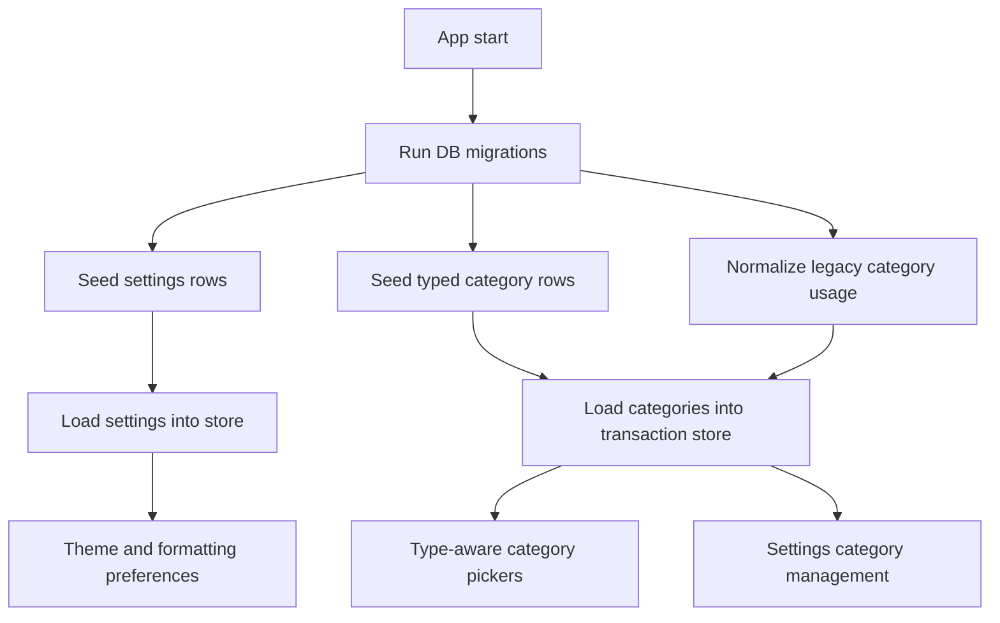

# Architecture Plan: Persistent Settings and Split Category Model

## Goals
- Separate expense and income categories consistently across persistence, stores, and UI.
- Persist app settings in the database instead of ephemeral store-only state.
- Keep existing transactions, budgets, reports, and editing flows backward-compatible.
- Make future settings and category expansion straightforward.

## Proposed Data Model

### 1. App settings table
Create a new settings table in [`src/db/schema.ts`](src/db/schema.ts) with a simple key-value structure:
- `key: TEXT PRIMARY KEY`
- `value: TEXT NOT NULL`

Why:
- Flexible for future settings without schema churn for every preference.
- Easy to hydrate into [`useSettingsStore`](src/store/useSettingsStore.ts).
- Allows typed parsing in the store while persisting a normalized string layer.

Initial persisted settings keys:
- `themeMode` with values `system | light | dark`
- `currencyCode` with values like `IDR`
- `useThousandsSeparator` with values `true | false`
- `dateFormat` with values like `en-GB`
- `showIncomeInReportsFirst` with values `true | false`

### 2. Categories table
Create a new categories table in [`src/db/schema.ts`](src/db/schema.ts):
- `id: INTEGER PRIMARY KEY`
- `name: TEXT NOT NULL`
- `type: TEXT NOT NULL` where `expense | income`
- `isSystem: INTEGER BOOLEAN DEFAULT 0`
- `createdAt: INTEGER NOT NULL`

Add a composite uniqueness rule in logic for `name + type`.

Why:
- Current in-memory [`categories`](src/store/useTransactionStore.ts:16) array is too flat.
- We need type-aware category selection for [`AddTransactionScreen`](src/screens/AddTransactionScreen.tsx:73), reports, budgets, and settings CRUD.
- `isSystem` provides guardrails for seeded defaults.

### 3. Budget model alignment
Keep the existing [`budgets`](src/db/schema.ts:10) table for now, but continue using category names as the linkage in this iteration.

Reasoning:
- Lowest-risk migration path.
- Avoids a broader budget foreign-key migration while category CRUD is first introduced.
- For rename/delete flows, store logic can update or block budget rows safely.

Future improvement:
- Move budgets from category name to category ID in a later migration once category CRUD is stable.

## Transaction Category Strategy

### Current state
Transactions currently store category in [`transaction_items.category`](src/db/schema.ts:33), and the app derives a single category per transaction in [`mapTransactionRowToModel()`](src/features/transactions/mappers.ts:17).

### New rule
Transactions remain stored with string categories for backward compatibility, but category choice becomes type-aware in app logic:
- expense transactions can only select expense categories
- income transactions can only select income categories
- legacy category strings are normalized during load and edit flows

### Backward-compatible normalization
Introduce normalization helpers in a new transaction/category utility layer, likely alongside [`src/features/transactions/constants.ts`](src/features/transactions/constants.ts) or a new file.

Rules:
1. If a transaction category matches an existing category of the same transaction type, keep it.
2. If it exists only in the opposite group, reassign to that type’s fallback uncategorized label.
3. If it is a legacy flat category:
   - map known income labels like `Salary`, `Freelance` to income
   - map known expense labels like `Bills`, `Transport`, `Groceries` to expense
4. Unknown legacy values:
   - preserve the raw stored transaction category for reporting/history
   - expose it in UI under a typed fallback bucket or auto-create as a custom category under the transaction’s type during migration

Recommended implementation:
- seed explicit default categories per type
- during migration/bootstrap, import legacy categories into typed rows using known mappings
- preserve unknown user-created categories by inferring type from existing transaction sign/type usage

## Seeded Defaults
Replace [`DEFAULT_CATEGORIES`](src/features/transactions/constants.ts:1) with typed defaults:
- expense defaults: Food & Dining, Transport, Groceries, Bills, Entertainment
- income defaults: Salary, Freelance
- fallback labels:
  - `Uncategorized Expense`
  - `Uncategorized Income`

This avoids the old mixed category list problem.

## Store Architecture

### 1. [`useSettingsStore`](src/store/useSettingsStore.ts)
Refactor into a persisted async-backed store with:
- state
  - `themeMode`
  - derived `isDarkMode` or helper selector
  - `currencyCode`
  - `useThousandsSeparator`
  - `dateFormat`
  - `showIncomeInReportsFirst`
  - `isLoaded`
- actions
  - `loadSettings()`
  - `setThemeMode()`
  - `setCurrencyCode()`
  - `setUseThousandsSeparator()`
  - `setDateFormat()`
  - `setShowIncomeInReportsFirst()`
  - generic internal `saveSetting()`

Implementation pattern:
- DB is source of truth.
- store hydrates on app startup in [`AppNavigator`](src/navigation/AppNavigator.tsx:82) alongside transaction bootstrapping.
- writes update state optimistically and persist immediately.

### 2. [`useTransactionStore`](src/store/useTransactionStore.ts)
Replace flat categories state with typed category collections and CRUD actions.

Recommended state shape:
- `categories: CategoryRecord[]`
- derived selectors/helpers:
  - `expenseCategories`
  - `incomeCategories`
  - `getCategoriesByType(type)`
- actions:
  - `fetchCategories()`
  - `addCategory(name, type)`
  - `renameCategory(id, nextName)`
  - `deleteCategory(id)`
  - `getCategoryUsage(name, type)`
  - `normalizeTransactionCategory(category, type)`

Behavior safeguards:
- prevent duplicate names within same type
- block delete for seeded fallback categories
- if deleting a category in use:
  - either block deletion and explain usage count
  - or offer reassignment in UI before delete

Recommended first release safeguard:
- block deletion when category is referenced by any transaction or budget
- allow rename with cascading updates to [`transaction_items`](src/db/schema.ts:30) and [`budgets`](src/db/schema.ts:10)

## Migration Plan

### DB version bump
Increment [`DB_SCHEMA_VERSION`](src/db/index.ts:7).

### Migration steps
1. Create `settings` table if missing.
2. Create `categories` table if missing.
3. Seed typed default category rows.
4. Read existing flat categories from:
   - old default list in app logic
   - existing transaction item categories
   - existing budget categories
5. Infer category type:
   - by known default map first
   - by transaction `type` usage next
   - by budget usage fallback to expense
6. Insert inferred categories if absent.
7. Seed default settings rows if absent.
8. Recreate AI/report views only if needed.

### Normalization heuristics
For any existing category used by both income and expense transactions:
- keep same label in both groups if needed
- uniqueness should be scoped to `name + type`, not name alone

This is important because labels like `Bonus` or `Adjustment` could validly appear in different contexts later.

## Screen Impact

### [`AddTransactionScreen`](src/screens/AddTransactionScreen.tsx:73)
Refactor category selection so it depends on transaction type:
- selected list updates when `type` changes
- if current category is invalid for new type, swap to typed fallback
- custom category creation from this screen should create a typed category, not a global one
- OCR-detected category should be normalized through typed category helpers before applying

### [`BudgetScreen`](src/screens/BudgetScreen.tsx:48)
Budgets should use expense categories only.
- Hide income categories completely.
- If legacy budget rows exist for income categories, either ignore or migrate them out with a one-time cleanup.

Recommended behavior:
- treat budgeting as expense-only in UI and migration.
- any existing budget attached to income category should remain stored but not shown, or be cleaned during migration if confidently identified.

### [`ReportsScreen`](src/screens/ReportsScreen.tsx:20)
Current report toggle already splits expense vs income by amount/type. Category grouping will continue to work if transaction categories are normalized consistently.

No major UI architecture change is required beyond using the new formatting/settings helpers later.

### [`SettingsScreen`](src/screens/SettingsScreen.tsx:16)
Expand into four sections:
1. Preferences
   - Theme mode
   - Currency code
   - Date format
   - Thousands separator toggle
   - optional report ordering toggle
2. Categories
   - Expense categories list
   - Income categories list
   - add/edit/delete flows
   - usage safeguards and system badges
3. Data
   - Export CSV
4. AI / About
   - preserve current AI information and version details

## Validation and Safeguards

### Category validation
- trim whitespace
- require non-empty names
- reject duplicates case-insensitively within same type
- permit same name across different types if needed

### Delete safeguards
Before deleting a category, calculate usage from:
- [`transaction_items.category`](src/db/schema.ts:33)
- [`budgets.category`](src/db/schema.ts:12)

If usage exists:
- block delete and surface why
- optionally propose rename/reassign instead

### Rename safeguards
When renaming:
- update category row
- cascade update transaction item rows with matching old name and type-context assumptions
- cascade update budget rows for expense categories

## Recommended Helper Modules

Add reusable helpers rather than embedding rules directly in screens:
- [`src/features/transactions/constants.ts`](src/features/transactions/constants.ts)
  - typed defaults and fallback labels
- new [`src/features/transactions/categories.ts`](src/features/transactions/categories.ts)
  - seed definitions
  - normalization helpers
  - inference helpers
  - validation helpers
- optionally new [`src/features/settings/types.ts`](src/features/settings/types.ts)
  - app settings type model

## Mermaid Overview

## Execution Plan
- Add typed category and settings schemas in [`src/db/schema.ts`](src/db/schema.ts).
- Add migration logic in [`src/db/index.ts`](src/db/index.ts) for settings seeding, typed categories, and legacy category inference.
- Replace flat category constants in [`src/features/transactions/constants.ts`](src/features/transactions/constants.ts) with explicit income/expense defaults and fallback labels.
- Add category normalization and validation helpers in a dedicated transaction category module.
- Refactor [`useSettingsStore`](src/store/useSettingsStore.ts) to load and persist DB-backed app settings.
- Refactor [`useTransactionStore`](src/store/useTransactionStore.ts) to fetch typed categories and expose CRUD plus usage-check APIs.
- Update [`AddTransactionScreen`](src/screens/AddTransactionScreen.tsx) to enforce type-aware category selection and typed custom category creation.
- Limit [`BudgetScreen`](src/screens/BudgetScreen.tsx) to expense categories only.
- Expand [`SettingsScreen`](src/screens/SettingsScreen.tsx) into a full settings and category management surface.
- Run TypeScript validation and then verify category migration, editing, renaming, deletion safeguards, and settings persistence flows.
